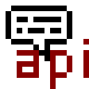

# Мод для движка VoxelCore

Этот мод добавляет функциональность отображения подсказок для предметов в руках в движке VoxelCore. Вы можете указать кнопку и текст подсказки как вместе, так и по отдельности.

**Версия движка:** v0.26.2

## Установка

1. Убедитесь, что у вас установлен движок VoxelCore ([github/MihailRis/VoxelEngine-Cpp](https://github.com/MihailRis/VoxelEngine-Cpp)).
2. Скопируйте файлы мода в соответствующую директорию вашего проекта (`./content`).
3. Скачайте и установите зависимости:
   - [voxel_core_react v0.1.0](https://github.com/VulpesDust/voxel_core_react)

## Использование

Мод не обязательно добавлять как зависимость для ваших модов

Для добавления подсказок к предметам используйте один из способов

### Способ 1: Через JSON

Добавьте в JSON-файл предмета следующий код:
```json
"hint_api:hint": [
    {
        "button": "ButtonName",
        "label": "Label"
    }
]
```
Параметры `button` и `label` не обязательны. Если их не указать, будет отображаться пустая строка.

### 2 Способ 2: Через Lua

```lua
local items = {}
items['mod_id:item_name'] = {
    {
        button = 'LMB',
        label = 'left mouse button'
    }
}

events.emit('hint_api:hint.add_hint_items()', items)
```

## Лицензия
Этот мод распространяется под лицензией MIT. Подробнее см. в файле [LICENSE](LICENSE).


## Author

- **Nickname**: VulpesDust
- **Name**: George Noise
- **Email**: george.noise.dev+github@gmail.com
- **Alternate Email**: vulpesdust+github@gmail.com
- **GitHub**: [VulpesDust](https://github.com/VulpesDust)
